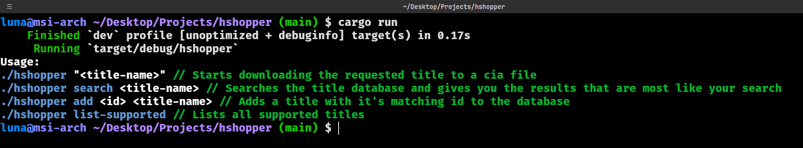
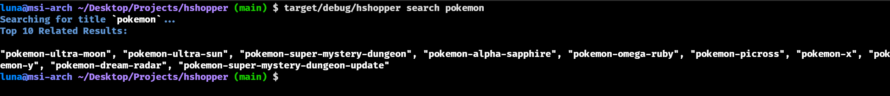
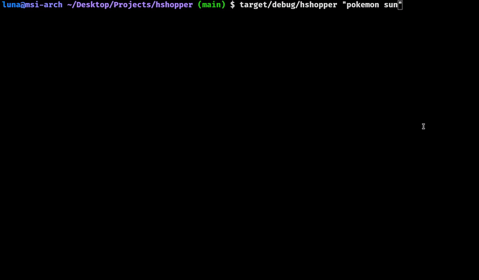
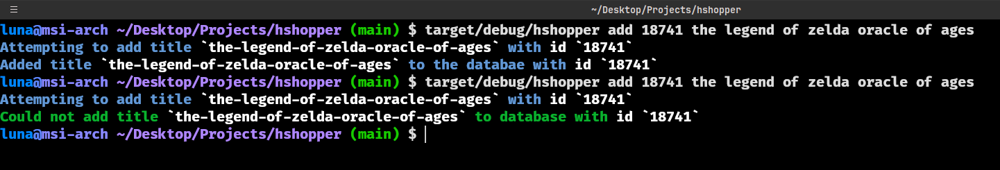
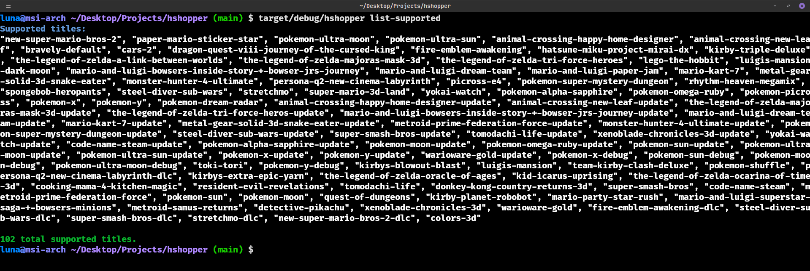

# hshopper

# ⚠️ This project is no longer supported or functional due to implementation of captcha to stop automated download requests

HShopper is a Rust-based utility to interact with the [hshop](https://hshop.erista.me/) 3DS ROM storage webpage. It simplifies searching, adding, and downloading titles directly from the terminal.

## Features

- Download Titles: Easily download a requested title as a `.cia` file.
- Search Titles: Find titles in the database based on partial or complete names.
- Add Titles: Add a new title and its associated ID to the database.
- List Supported Titles: Retrieve a list of all titles currently supported by the system.

## Usage

Run the `hshopper` executable with the following commands:

  

## Example Scenarios

Search for a title:  
  

Download a title:  
  

Add a new title:  
  

List all supported titles:  

## Contributing

Contributions are welcome! Please ensure all code adheres to Rust best practices and includes appropriate documentation. Check out [CONTIBUTING](CONTRIBUTING.md)

## License

HShopper is open-source and available under the [MIT License](LICENSE).
